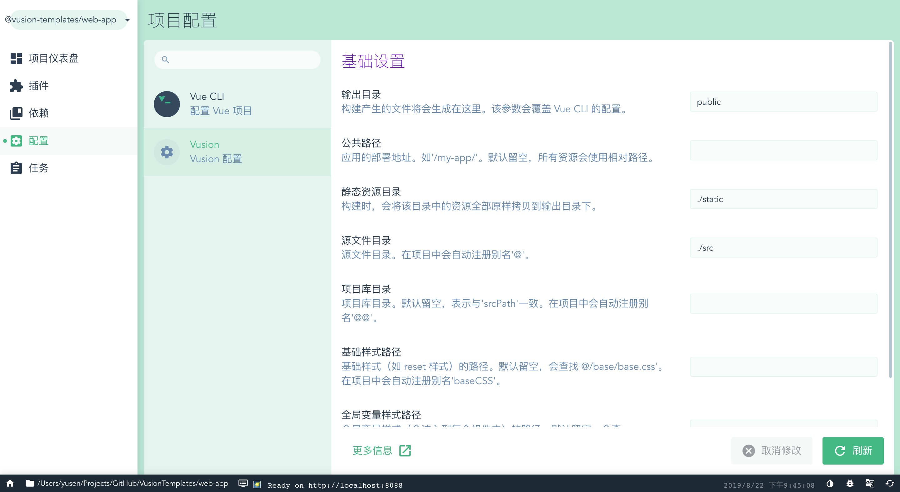

# vue-cli-plugin-vusion

Vue CLI Plugin for Vusion Projects

[![CircleCI][circleci-img]][circleci-url]
[![NPM Version][npm-img]][npm-url]
[![Dependencies][david-img]][david-url]
[![NPM Download][download-img]][download-url]

[circleci-img]: https://img.shields.io/circleci/project/github/vusion/vue-cli-plugin-vusion.svg?style=flat-square
[circleci-url]: https://circleci.com/gh/vusion/vue-cli-plugin-vusion
[npm-img]: http://img.shields.io/npm/v/vue-cli-plugin-vusion.svg?style=flat-square
[npm-url]: http://npmjs.org/package/vue-cli-plugin-vusion
[david-img]: http://img.shields.io/david/vusion/vue-cli-plugin-vusion.svg?style=flat-square
[david-url]: https://david-dm.org/vusion/vue-cli-plugin-vusion
[download-img]: https://img.shields.io/npm/dm/vue-cli-plugin-vusion.svg?style=flat-square
[download-url]: https://npmjs.org/package/vue-cli-plugin-vusion



## Vusion Config

``` js
{
    type: '', // Vusion 项目类型，如：'app', 'library', 'component', 'block', 'repository'
    outputPath: '', // 如果设置，vue.config.js 的 `outputDir` 属性
    publicPath: '', // 如果设置，vue.config.js 的 `publicPath` 属性
    staticPath: '', // 静态资源目录。构建时，会将该目录中的资源全部原样拷贝到输出目录下。
    srcPath: './src', // 源文件目录。在项目中会自动注册别名'@'。
    libraryPath: '', // 项目库目录。默认留空，表示与'srcPath'一致。在项目中会自动注册别名'@@'。
    baseCSSPath: '', // 基础样式（如 reset 样式）的路径。默认留空，会查找'@/base/base.css'。在项目中会自动注册别名'baseCSS'。
    theme: undefined, // 选择主题。主题 CSS 所在的路径，主题名称为 CSS 名。也可以为一个对象。
    applyTheme: false, // 应用主题，将主题变量注入到 CSS 中。如果需要兼容 IE 浏览器，必须开启。
    docs: false, // 文档配置
    alias: { // 用于设置 Webpack 别名
        '@': path.resolve(__dirname, 'src'),
        ...
    },
};
```

## Commands

### 全局

- 增加了 alias
- 增加了 vue-multifile-loader
- 对 CSS 做了处理

### library-build

专门针对库进行构建。

#### --theme

设置主题。

#### --vusion-mode raw

原生模式，一般在打包组件库时使用，不处理 babel、icon-font、css-sprite。

#### --base-css

设置 Base CSS 的路径。

#### --cache

缓存库的打包。

#### --output-path

覆盖默认的 output.path。

#### --public-path

覆盖默认的 publicPath。

#### --src-path

覆盖默认的 srcPath。

#### --library-path

覆盖默认的 libraryPath。

### doc

开发文档，启动文档的 dev 服务。

### doc-build

构建文档。

## Generator

没有 Generator，请使用 [vusion init](https://github.com/vusion/vusion)

## UI

增加了 Vusion Config 的配置界面。

## Changelog

See [Releases](https://github.com/vusion/vue-cli-plugin-vusion/releases)

## Contributing

See [Contributing Guide](https://github.com/vusion/DOCUMENTATION/issues/8)

## License

[MIT](LICENSE)
